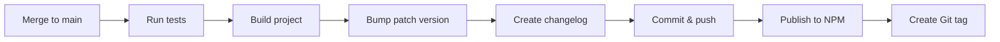

# NPM Auto-Publishing Setup Guide

This guide explains how to set up automatic NPM publishing for gaia-agent.

## Quick Setup (5 minutes)

### Step 1: Create NPM Access Token

1. Go to https://www.npmjs.com/settings/[your-username]/tokens
2. Click **"Generate New Token"** → **"Classic Token"**
3. Select token type: **"Automation"**
4. Copy the token (starts with `npm_...`)

### Step 2: Add Token to GitHub

1. Go to https://github.com/gaia-agent/gaia-agent/settings/secrets/actions
2. Click **"New repository secret"**
3. Name: `NPM_TOKEN`
4. Value: [paste your npm token]
5. Click **"Add secret"**

### Step 3: Verify Workflow

The workflow file `.github/workflows/publish.yml` is already configured.

It will automatically run when you push to `main` branch.

## How It Works

### Automatic Process



### Version Strategy

- **Patch bumps** (0.1.0 → 0.1.1): Automatic on every merge to `main`
- **Minor bumps** (0.1.0 → 0.2.0): Manual before merging
- **Major bumps** (0.1.0 → 1.0.0): Manual before merging

## Usage Examples

### Regular Workflow (Auto Patch)

```bash
# 1. Make changes in a branch
git checkout -b feat/new-feature
# ... make changes ...
git commit -m "feat: add new search provider"
git push origin feat/new-feature

# 2. Create PR and merge to main
# 3. GitHub Action automatically:
#    - Runs tests
#    - Bumps version: 0.1.0 → 0.1.1
#    - Creates changelog/RELEASE_2025-11-11_v0.1.1.md
#    - Publishes to npm
#    - Creates git tag v0.1.1
```

### Manual Minor Version Bump

```bash
# Update package.json version before merging
npm version minor --no-git-tag-version
# 0.1.5 → 0.2.0

git add package.json
git commit -m "chore: bump minor version to 0.2.0"
git push origin main

# Action will publish 0.2.0 (not bump to 0.2.1)
```

### Manual Major Version Bump

```bash
npm version major --no-git-tag-version
# 0.5.0 → 1.0.0

git add package.json
git commit -m "chore: release v1.0.0 - BREAKING CHANGES"
git push origin main

# Action will publish 1.0.0
```

## Changelog Management

### Automatic Changelogs

Created in `changelog/RELEASE_[date]_[version].md`:

```markdown
# Release v0.1.6

Date: 2025-11-11

## Changes

Auto-released from main branch.

## Commits

abc1234 feat: add stream mode to benchmark
def5678 fix: update parquet parsing
...

## Build Info

- Node: v20.10.0
- NPM: 10.2.0
- pnpm: 9.0.0
```

### Manual Changelogs

For major features or refactorings, create manual changelogs:

```bash
# Create detailed changelog
cat > changelog/FEATURE_2025_11_11_streaming.md << EOF
# Streaming Support

Date: November 11, 2025

## Overview
Added real-time streaming support to benchmark runner...

## New Features
- Stream mode with --stream flag
- Real-time agent thinking output
...
EOF

git add changelog/
git commit -m "docs: add streaming feature changelog"
```

## Troubleshooting

### Problem: "Error: You cannot publish over the previously published versions"

**Solution:**
```bash
# Check current npm version
npm view gaia-agent version

# Manually bump to next version
npm version patch --no-git-tag-version
git add package.json
git commit -m "chore: fix version conflict"
git push
```

### Problem: "Error: npm ERR! 403 Forbidden"

**Solution:**
1. Verify NPM_TOKEN is correct in GitHub Secrets
2. Check token hasn't expired
3. Verify you have publish permissions for `gaia-agent` package

### Problem: Action fails at "Commit version bump"

**Solution:**
1. Go to repo Settings → Actions → General
2. Scroll to "Workflow permissions"
3. Select "Read and write permissions"
4. Check "Allow GitHub Actions to create and approve pull requests"
5. Click "Save"

### Problem: Want to skip auto-publish for a commit

**Solution:**
```bash
git commit -m "docs: update README [skip ci]"
```

The `[skip ci]` flag prevents the workflow from running.

## Best Practices

### 1. Use Pull Requests

Always merge to `main` via PR:
- Allows code review
- Runs tests before publish
- Prevents accidental publishes

### 2. Semantic Versioning

Follow [semver](https://semver.org/):
- **Patch** (0.0.x): Bug fixes, typos, small changes
- **Minor** (0.x.0): New features, backward compatible
- **Major** (x.0.0): Breaking changes

### 3. Test Before Merge

Run locally before pushing:
```bash
pnpm test          # All tests must pass
pnpm build         # Build must succeed
pnpm typecheck     # No type errors
```

### 4. Monitor Releases

After merging:
1. Check GitHub Actions tab for workflow status
2. Verify package on npmjs.com: https://www.npmjs.com/package/gaia-agent
3. Test installation: `npm install gaia-agent@latest`

## Advanced Configuration

### Change Auto-Bump Strategy

Edit `.github/workflows/publish.yml`:

```yaml
# Current: Auto patch bump
- name: Bump patch version
  run: npm version patch --no-git-tag-version

# Option 1: No auto-bump (manual only)
# Comment out the bump step

# Option 2: Auto minor bump
- name: Bump minor version
  run: npm version minor --no-git-tag-version
```

### Add Pre-publish Checks

Add to workflow before publish step:

```yaml
- name: Check bundle size
  run: |
    npm run build
    du -sh dist/
    
- name: Verify exports
  run: node -e "require('./dist/index.js')"
```

### Publish to Multiple Registries

Add npm alternatives:

```yaml
- name: Publish to GitHub Packages
  run: |
    echo "@gaia-agent:registry=https://npm.pkg.github.com" > .npmrc
    pnpm publish
  env:
    NODE_AUTH_TOKEN: ${{ secrets.GITHUB_TOKEN }}
```

## Rollback a Release

If you need to unpublish or fix a bad release:

```bash
# Option 1: Unpublish (within 72 hours)
npm unpublish gaia-agent@0.1.6

# Option 2: Publish a patch fix
npm version patch  # 0.1.6 → 0.1.7
# Fix the issue
git add .
git commit -m "fix: critical bug in 0.1.6"
git push origin main
```

## Security

- ✅ NPM_TOKEN has automation permissions (limited scope)
- ✅ Token is stored in GitHub Secrets (encrypted)
- ✅ Workflow runs in isolated environment
- ✅ No token exposed in logs
- ⚠️ Rotate token every 90 days for security

## Monitoring

### Check Latest Release

```bash
# From command line
npm view gaia-agent version

# From package.json
cat package.json | grep version

# From GitHub tags
git tag -l
```

### View Publish History

- GitHub: https://github.com/gaia-agent/gaia-agent/actions
- NPM: https://www.npmjs.com/package/gaia-agent?activeTab=versions
- Git tags: `git tag -l --sort=-v:refname`

## Questions?

- Workflow not running? Check `.github/workflows/publish.yml`
- Publish failed? Check GitHub Actions logs
- Version conflict? Manually bump and retry
- Need help? Check `.github/workflows/README.md`
